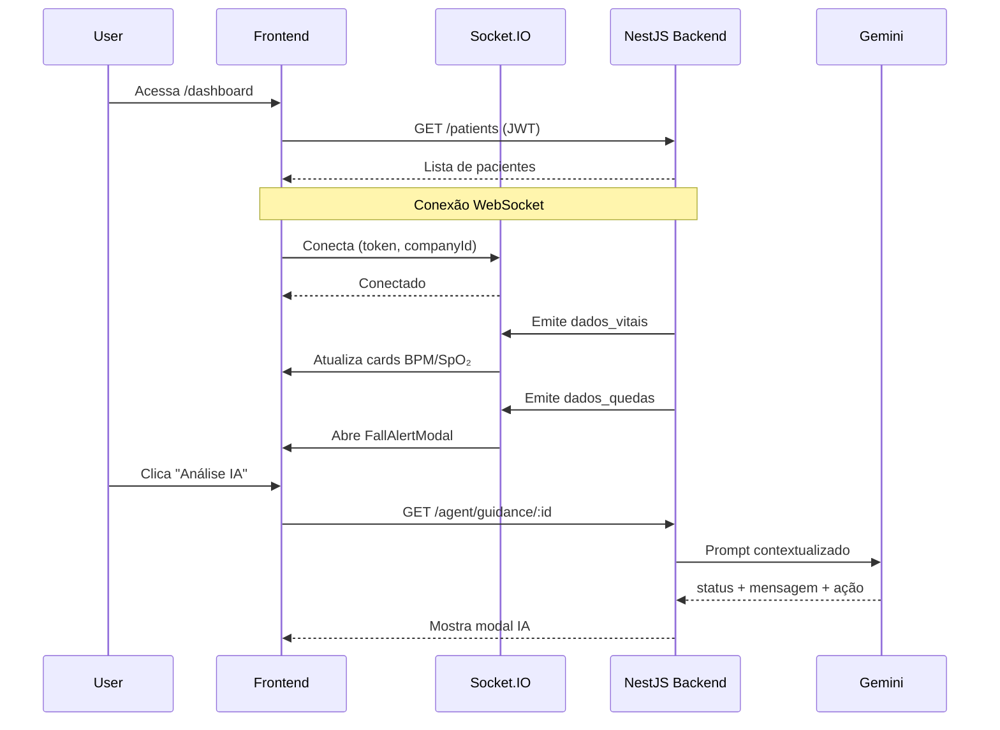

# VitalMonitor – Frontend (Next.js + React)

Interface moderna e responsiva para **monitoramento assistivo de sinais vitais em tempo real**.
Focada em **equipes clínicas, cuidadores e familiares**, com design clean, alertas críticos visuais e integração com **IA (Google Gemini)**.

**Status do projeto:** MVP funcional com dashboard médico, detalhe de paciente, análise IA sob demanda e geração manual de relatórios.

---

## ✨ Funcionalidades Principais

### 🩺 Dashboard Médico ao Vivo (`/dashboard`)

* Cards em grid com **BPM e SpO₂ em tempo real**
* Status de conexão **WebSocket** + indicador visual de criticidade (vermelho pulsante)
* Modal de **queda detectada** com opções de ação (falso positivo / chamar ajuda)
* Botão de **análise IA por paciente** (abre modal com parecer Gemini)

### 👤 Página de Detalhe do Paciente (`/patient/[id]`)

* Visão em tempo real de **BPM e SpO₂** (via WebSocket)
* **Gráfico linear (Recharts)** com histórico recente
* Última predição de risco IA (**LOW / MODERATE / HIGH**) com barra de score
* Seleção de **atividade atual** (repouso, dormindo, atividade física…)

  * Atualiza thresholds no backend em tempo real
* Alerta visual grande e persistente em caso de **queda**

### 🤖 Análise IA sob Demanda (`/patient/[id]/agent`)

* Exibe contexto dos sensores (BPM atual × média 7 dias)
* Botão **“Analisar com Inteligência Artificial”** → consulta Gemini 1.5 Flash
* Retorno estruturado:

  * Status (NORMAL / ATENÇÃO / ALERTA)
  * Mensagem explicativa
  * Recomendação prática

### 📄 Gerador de Relatórios Manuais (`/reports`)

* Lista de pacientes
* Seleção individual
* Geração de **PDF semanal**
* Envio automático por **e-mail**
* Feedback visual de sucesso / erro

### 🔐 Login Profissional (`/login`)

* Layout **split-screen** (imagem hospitalar + formulário clean)
* Validação visual de erro
* Loading states
* Rotas protegidas com redirecionamento automático

### 🧠 Contexto de Autenticação (`AuthContext`)

* Gerenciamento de **JWT** via cookie + localStorage
* Parse do payload:

  * `sub`, `email`, `role`, `companyId`, `companyName`, `activities`
* Proteção de rotas
* Logout global

---

## 🧱 Tecnologias Utilizadas (Frontend)

| Categoria     | Tecnologia                  | Finalidade                        |
| ------------- | --------------------------- | --------------------------------- |
| Framework     | Next.js 14 (App Router)     | SSR, Client Components, Routing   |
| UI / Ícones   | Tailwind CSS + lucide-react | Estilização moderna e consistente |
| Estado Global | React Context (Auth)        | Autenticação e sessão             |
| Tempo Real    | Socket.IO Client            | Dados vitais e quedas             |
| Gráficos      | Recharts                    | Visualização de BPM / SpO₂        |
| HTTP          | fetch + axios               | Comunicação com API NestJS        |
| Animações     | Tailwind + animate.css      | Modais, alertas e transições      |

---

## 🗂️ Estrutura de Páginas e Componentes

```text
app/
├── dashboard/                  # DoctorDashboard.tsx
├── patient/[id]/               # Detalhe do paciente
│   └── page.tsx
├── patient/[id]/agent/         # Análise IA sob demanda
│   └── page.tsx
├── login/                      # LoginPage.tsx
├── reports/                    # ReportManagerPage.tsx
├── register/                   # CadastroUnificado.tsx
├── contexts/
│   └── AuthContext.tsx         # Provider + useAuth

components/                     # Componentes reutilizáveis
├── FallAlertModal.tsx
└── AIAnalysisModal.tsx
```

---

## 🔄 Fluxo Principal de Dados (Frontend ↔ Backend)



---

## ▶️ Como Rodar (Frontend)

### Pré-requisitos

* Node.js ≥ 18
* Backend NestJS rodando (default: `http://localhost:3001`)

### Variáveis de Ambiente (`.env.local`)

```env
NEXT_PUBLIC_API_URL=http://localhost:3001
```

### Comandos

```bash
# Instalar dependências
npm install

# Desenvolvimento
npm run dev
# → http://localhost:3000

# Build produção
npm run build

# Iniciar produção
npm run start
```

---

## 🗺️ Próximos Passos (Roadmap Frontend)

* Dark mode (next-themes)
* Paginação e filtros avançados no dashboard
* Toast notifications (react-hot-toast) para alertas
* Mapa de localização (se disponível no dispositivo)
* Suporte multilíngue (pt-BR / en)
* Testes E2E (Playwright ou Cypress)
* PWA (manifest + ícone para tablets/celulares)
* Componentização de modais repetidos (DRY)

---

## 📄 Licença

MIT

---

**VitalMonitor Frontend**
Tecnologia assistiva com design humano-centrado
Fortaleza, Brasil — 2026
